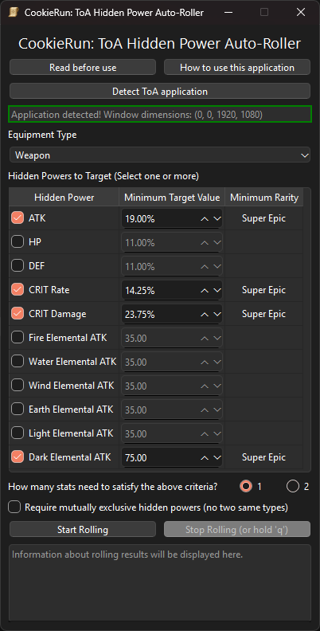

# CookieRun: Tower of Adventures - Hidden Power Auto-Roller

### Note: Due to "unfortunate" news that a future update will feature a built-in method of auto-rolling hidden powers, this application will become quickly obsolete and will no longer receive further development.

This is an application meant to be used alongside the CookieRun: Tower of Adventures game, to facilitate the process of rolling for hidden powers on equipment based on various criteria such as equipment type, hidden power type, and minimum value.

## Technologies used
- Python 3.12
  - PySide6
  - PyTesseract

## Application Usage



1. Click the "Detect ToA application" and check to make sure the application has been detected before continuing.
2. Select the equipment type that you are rolling (Weapon/Headwear/Bodywear/Legwear), as the types of hidden powers 3. In the "Hidden Powers to Target" section, select any of the hidden powers that you are targeting, along with the minimum numerical value you desire.
    - The application will essentially stop rolling when it sees new hidden powers that match the targeted selections. 
4. For the criteria radio buttons section, select 1 or 2 depending on whether you want one or both of the stats to match the chosen hidden powers.
5. The "Require mutually exclusive..." button makes it so getting two of the same hidden power type does not count as a satisfactory roll, and will continue rolling.
6. From there, click "Start Rolling" to start the application alternating between clicking the "Change Power" in-game, checking the new powers, and either continuing to roll if the stats don't match or stopping if they do.
    - Otherwise, you can manually stop rolling by clicking the "Stop Rolling" button, 'q' on your keyboard, or slamming your mouse cursor to the corner of your screen as a failsafe.
    - As this application uses OCR to parse the hidden power values, do not block the text with your cursor or other objects to minimize erroneous readings.
   - It is recommended to try the application with some lenient hidden power rolls first to make sure it works as expected with your system.

These instructions are also found in the application itself, under "How to use this application".

## How to build

PyInstaller configurations:

```pyinstaller  --name "CR-ToA Hidden Power Auto-Roller" --noconsole --icon=images/scroll_of_potential.ico --add-data="images;images" --add-data="sounds;sounds" --add-data="Tesseract-OCR;Tesseract-OCR" --onefile toaApp.py```
